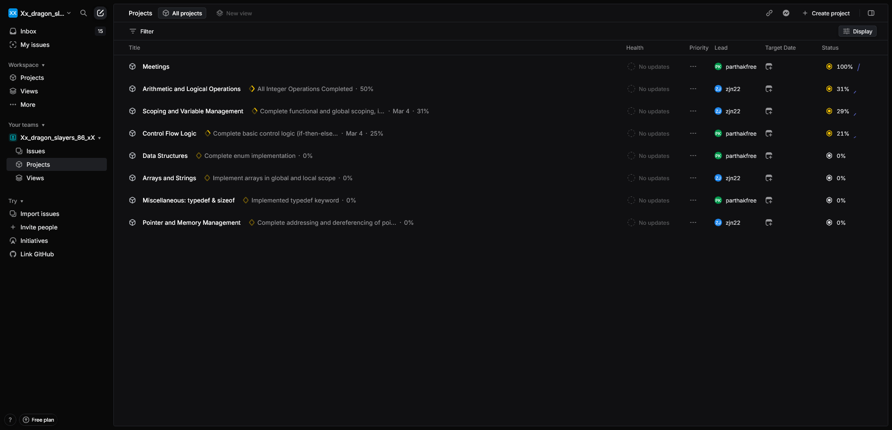
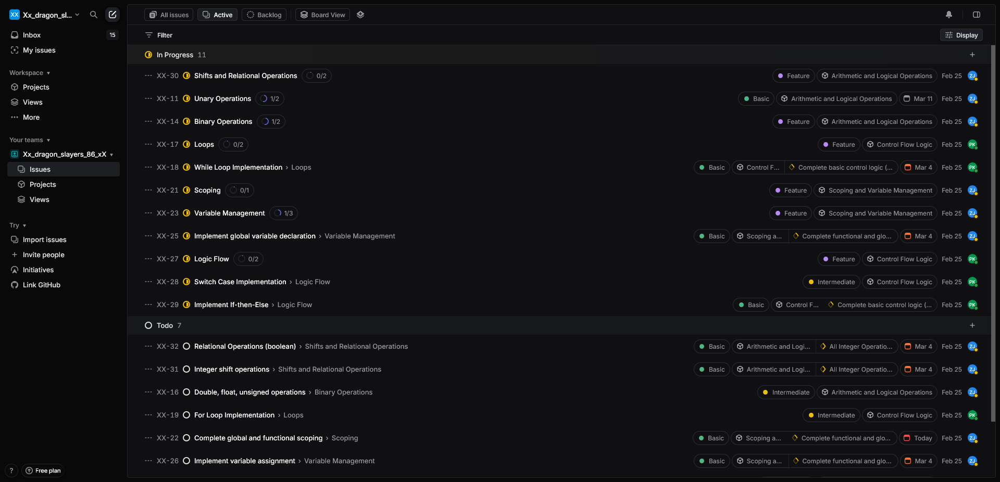
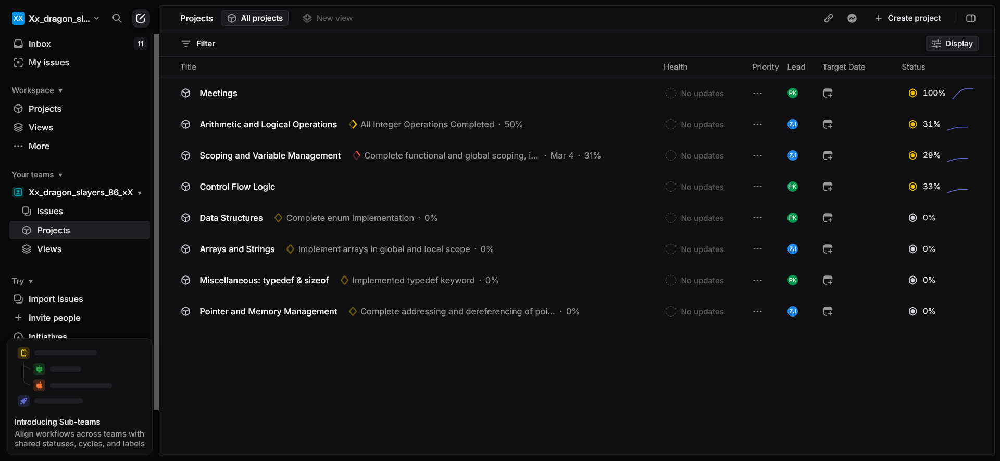
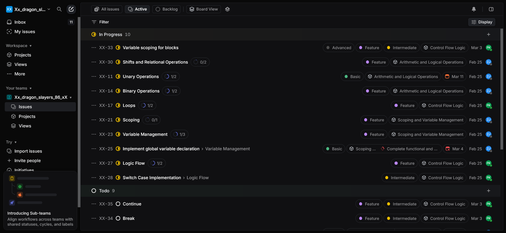

# Compiler Project Management Report

## Table of Contents
1. [Project Overview](#project-overview)

## Project Overview

Our ANSI C (C90) to RISC-V compiler focuses on creating a lexer, parser, robust AST structure and code generation. This report outlines our project management approach, milestones, time allocation, and progress tracking methods used in this project alongside linear, a tool used by both of us comprehensively in this project.

## Project Management Approach

We adopted a structured approach to project management that included:

1. **Regular meetings**: Scheduled twice-weekly meetings to ensure consistent progress and communication
2. **Task tracking**: Used Linear.app to define, assign, and track issues and tasks
3. **Milestone planning**: Created clear milestones with dependencies and owner assignments
4. **Time estimation**: Planned weekly effort estimates while considering other course deadlines
5. **Progress tracking**: Maintained a log of actual hours spent and adjusted estimates accordingly

## Milestones
Observing the required components:
- **Basic:**
    | # | Description | Assignee |
    | --- | --- | --- |
    | A1  | *a file containing just a single function with no arguments* | Joel |
    | A2  | *variables of int type* | Partha |
    | A3  | *local variables* | Joel |
    | A4  | *arithmetic and logical expressions* | Joel |
    | A5  | *if-then-else statements* | Partha |
    | A6  | *while loops* | Partha |
- **Intermediate:**
    | # | Description | Assignee |
    | --- | --- | --- |
    | B1  | *files containing multiple functions that call each other* |  |
    | B2  | *functions that take up to 8 parameters* | Joel |
    | B3  | *for loops* | Partha |
    | B4  | *arrays declared globally* | Joel |
    | B5  | *arrays declared locally* | Joel |
    | B6  | *array initialization* | Joel |
    | B7  | *reading and writing elements of an array* | Joel |
    | B8  | *recursive function calls* |  |
    | B9  | *the enum keyword* | Partha |
    | B10 | *switch statements* | Partha |
    | B11 | *the break and continue keywords* | Partha |
    | B12 | *ternary operator* | Partha |
- **Advanced:**
    | # | Description | Assignee |
    | --- | --- | --- |
    | C1  | *variables of double, float, char, unsigned, structs, and pointer types* |  |
    | C2  | *calling externally-defined functions* |  |
    | C3  | *functions that take more than 8 parameters* |  |
    | C4  | *mutually recursive function calls* |  |
    | C5  | *locally scoped and block scoped variable declarations* | Both |
    | C6  | *the typedef keyword* |  |
    | C7  | *the sizeof(...) function (which takes either a type or a variable)* |  |
    | C8  | *taking the address of a variable using the & operator* |  |
    | C9  | *dereferencing a pointer-variable using the * operator* |  |
    | C10 | *pointer arithmetic* |  |
    | C11 | *character literals, including escape sequences like \n* |  |
    | C12 | *strings (as NULL-terminated character arrays)* |  |
    | C13 | *declaration and use of structs* |  |

| Milestone | Description | Dependencies | Owner | Status | Est. Hours | Actual Hours |
|-----------|-------------|--------------|-------|--------|------------|--------------|
|

## Actual Effort and Adjustment Log

We maintained a weekly log of actual hours spent and made necessary adjustments considering other priorities and deadlines:

### Week 1: Project Setup and Basic Features (A rank)
- **Planned**: 30 hours total
- **Actual**: 40 hours
- **Assessment**: A lot of time spent studying the repository structure, and understanding implementations
- **Adjustment**: Include time for understanding criteria and key features prior to development.

### Week 2 and 3: Intermediate Features except B1 and B8
- **Planned**: 60 hours total
- **Actual**: 20 hours
- **Assessment**: Not as much time dedicated due to other projects alongside
- **Adjustment**: Need to put more work into the project and dedicate more time once other project milestones are achieved.

### Week 4: Complete previous week items and more?
- **Planned**:
- **Actual**:
- **Assessment**:
- **Adjustment**:

## Linear.app Integration

Our Linear.app project board has been crucial for task tracking:

1. **Issues**: Each feature or bug was tracked as an individual issue with clear acceptance criteria
2. **Projects**: Grouped related issues into projects aligned with our milestones
3. **Tasks**: Broke down complex issues into manageable tasks
4. **Assignment**: Clearly assigned ownership of each issue to team members
5. **Prioritisation**: Used the priority system to focus on critical path items (as per dependencies)
6. **Labels**: Added labels for "blocked," "needs review," etc.

This is visible through the following screenshots of the linear app being continuously updated.

### Week 1: (18/02 to 24/02)
|  |  |
| --- | --- |

### Week 2 and 3: (04/03 to 10/03)
|  |  |
| --- | --- |

### Week 4: (11/03 to 17/03)
|  |  |
| --- | --- |

### Week 5: (18/03 to 21/03)
|  |  |
| --- | --- |

## GitHub workflow

1. **Branch naming**: Using relevant branch names for traceability
2. **Commit messages**: Meaningful commit messages
3. **Pull requests**: Linked PRs to linear tasks
4. **Code reviews**: Used GitHub PR reviews and comments to maintain code quality

## Lessons Learned

## Conclusion

